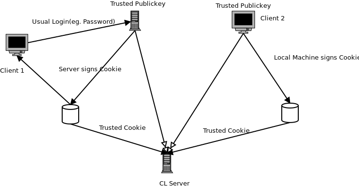

CookieLogin
###########

A simple cryptographic login system.
Uses Cryptographic cookies and/or passwords to login.

Other login methods might be added.

Design
======

This is a typical application for CookieLogin:

A usual server (e.g. a Webapplication / Blog) signs a cookie.
The client (Client 1) is now able to log into the CL Server.

Or the client (Client 2) has a trusted keypair and is able to sign his own cookie.
Note that in this case the client must know his own IP address.

Testing
=======

unzip the file "test.zip" in the parent directory and move
the directory "CookieLogin" into "chat/CookieLogin". Then
run ``python3 -m chat.test``.
